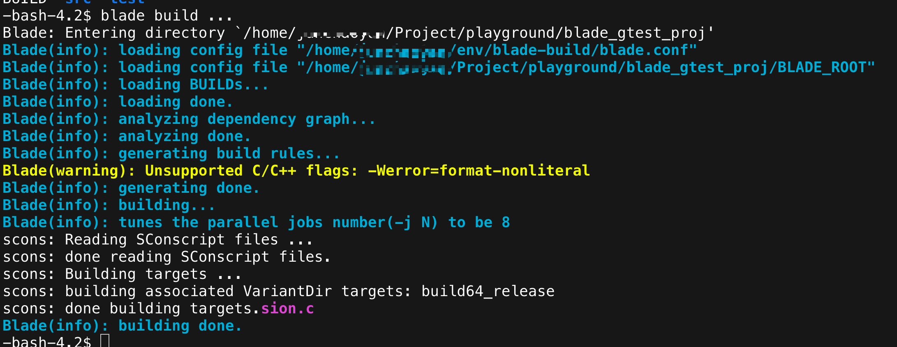
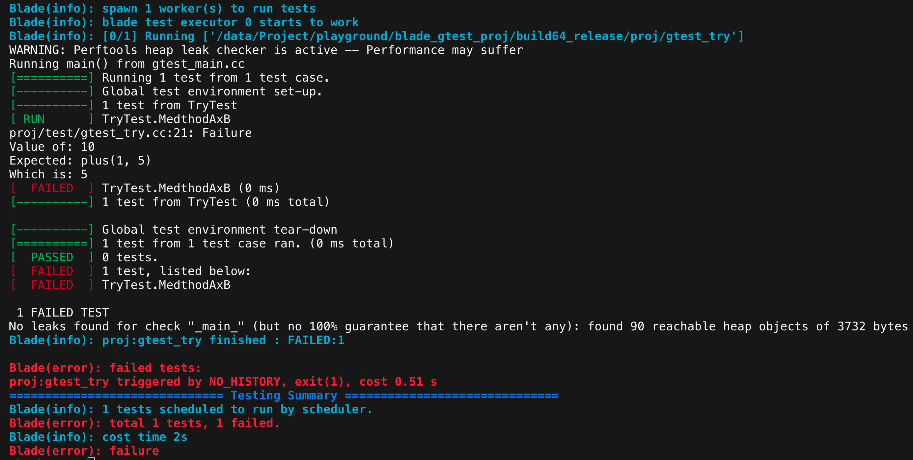

# blade_gtest_proj
A c/c++ project initialized with blade &amp;&amp; gtest

## Project structure
```
blade_gtest_proj/
|-- BLADE_ROOT
|-- common 
|-- thirdparty
|-- docs
|-- proj
    |-- src
    |-- test
    `-- BUILD
```
+ **BLADE_ROOT**是blade编译的顶层
+ **common** 存放一些公共的库和工具
+ **thirdparty** 放置第三方软件，这里主要是gtest、gflags和perftool
+ **docs** 说明文档、设计文档等
+ **proj** 项目源代码

## First try
+ 第一步
编写了一个plus函数，放在proj/src/plus.c中，
```
int plus(int a, int b) {
    return a*b;
}
```
同时定义一个头文件, proj/src/plus.h。
编写BUILD中的```cc_library``` 。

+ 第二步
编写一个带main函数的入口函数，proj/src/try/plus_try.cc。
接下来，定义好BUILD文件中的```cc_binary```

+ 第三步
编写一个gtest测试, proj/test/gtest_try.cc,
定义好BUILD文件中的```cc_test```。

大功告成，在proj/目录下运行```blade build ...```,
你就会得到编译成功的提示。


运行```blade test```可以进行单元测试


## more
关于blade，请参考https://github.com/chen3feng/blade-build.git

关于gtest，请参考https://github.com/google/googletest.git

